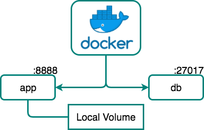

# Simple deploy with docker-compose 

Suposing that `Docker` is installed, which comes with `docker-compose` natively. This task consists on a simgle deploy of the system with `docker-compose` on a local enviroment.

## Initial requirements

+ [`Docker` and `docker-compose`](https://www.docker.com/products/docker-desktop)
+ Clone [`docker-chat`](https://github.com/ageapps/docker-node-mongo) repository
    ```bash
    git clone https://github.com/ageapps/docker-node-mongo
    ```
    
## Setup

+ __Web (app):__ [NodeJS] server containin all business logic and that [features](#features)  mentioned above. It uses the official [NodeJS image] as base image.
+ __Database (db):__ [MongoDB] database. It uses the official [MongoDB image] with an additional startup script which sets up users in order to have a securized database (using `MONGO_DB_APP_PASSWORD`, `MONGO_DB_APP_USERNAME`, `MONGO_DB_APP_DATABASE` enviroment variables).

## Steps
### Deployment
```bash
$ cd app
$ docker-compose up -d
Creating network "docker-node-mongo_default" with the default driver
Creating docker-node-mongo_db_1 ...
Creating docker-node-mongo_db_1 ... done
Creating docker-node-mongo_server_1 ...
Creating docker-node-mongo_server_1 ... done
# connect in your browser to <host IP>:8080
$ docker ps
CONTAINER ID        IMAGE                      COMMAND                  CREATED             STATUS                   PORTS                 NAMES
0759499a5d76        docker-node-mongo_server   "nodemon ./bin/www"      3 minutes ago       Up 3 minutes             0.0.0.0:8080->3000/tcp   docker-node-mongo_server_1
1298b956bcad        mongo                      "docker-entrypoint.s…"   3 minutes ago       Up 3 minutes (healthy)   27017/tcp                docker-node-mongo_db_1

```
### Clean Enviroment
```
# To stop the system
$ docker-compose down -v
Stopping docker-node-mongo_server_1 ... done
Stopping docker-node-mongo_db_1  ... done
Removing docker-node-mongo_server_1 ... done
Removing docker-node-mongo_db_1  ... done
Removing network docker-node-mongo_default
```

[NodeJS image]: https://hub.docker.com/_/node/
[MongoDB image]: https://hub.docker.com/_/mongo/
[MongoDB]: https://www.mongodb.com
[mongoose]: http://mongoosejs.com/index.html
[NodeJS]: http://nodejs.org
[Docker]: https://docs.docker.com/
[docker-compose]:https://docs.docker.com/compose/compose-file/
[docker-build]:https://docs.docker.com/engine/reference/builder/
