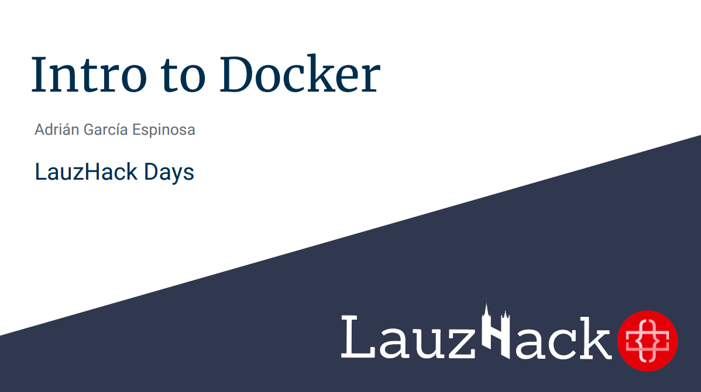

# lauzhack-docker-workshop

This repo corresponds to a workshop done in the EPFL during the [LauzHack 2018 Days](https://lauzhack.com/workshops).

Slides can be found [HERE](https://speakerdeck.com/adrian_gespi/intro-to-docker-lauzhack-days)

## Initial steps

This workshop is a basic introduction to [Docker]. It aims to give an overview of how powerfull [Docker] is and how it has revolutionized the cloud industry.

## Task 1
This is going to be as simple as running a simple app locally. For this we're going to use [`Node.js`](https://nodejs.org/en/).

Jump to [task 1](./1-simple-server) directory.
## Task 2
This task consists on running out application in a docker container.

Jump to [task 2](./2-dockerize-app) directory.
## Task 3
This task consists on a simgle deploy of the system with `docker-compose` on a local enviroment.

Jump to [task 3](./3-docker-compose) directory.

## Resources
+ [Docker]: Software containerization platform
+ [NodeJS]: Server enviroment.
+ [MongoDB]: NoSQL database system.
+ [mongoose]: MongoDB object modeling for *node.js*.
+ [docker-build]: Automated build of *Docker* images.
+ [docker-compose]: Automated configuration and run of multi-container *Docker* applications.

[Microservices architecture]: http://microservices.io/patterns/microservices.html
[NodeJS image]: https://hub.docker.com/_/node/
[MongoDB image]: https://hub.docker.com/_/mongo/
[MongoDB]: https://www.mongodb.com
[mongoose]: http://mongoosejs.com/index.html
[NodeJS]: http://nodejs.org
[Docker]: https://docs.docker.com/
[docker-compose]:https://docs.docker.com/compose/compose-file/
[docker-build]:https://docs.docker.com/engine/reference/builder/
